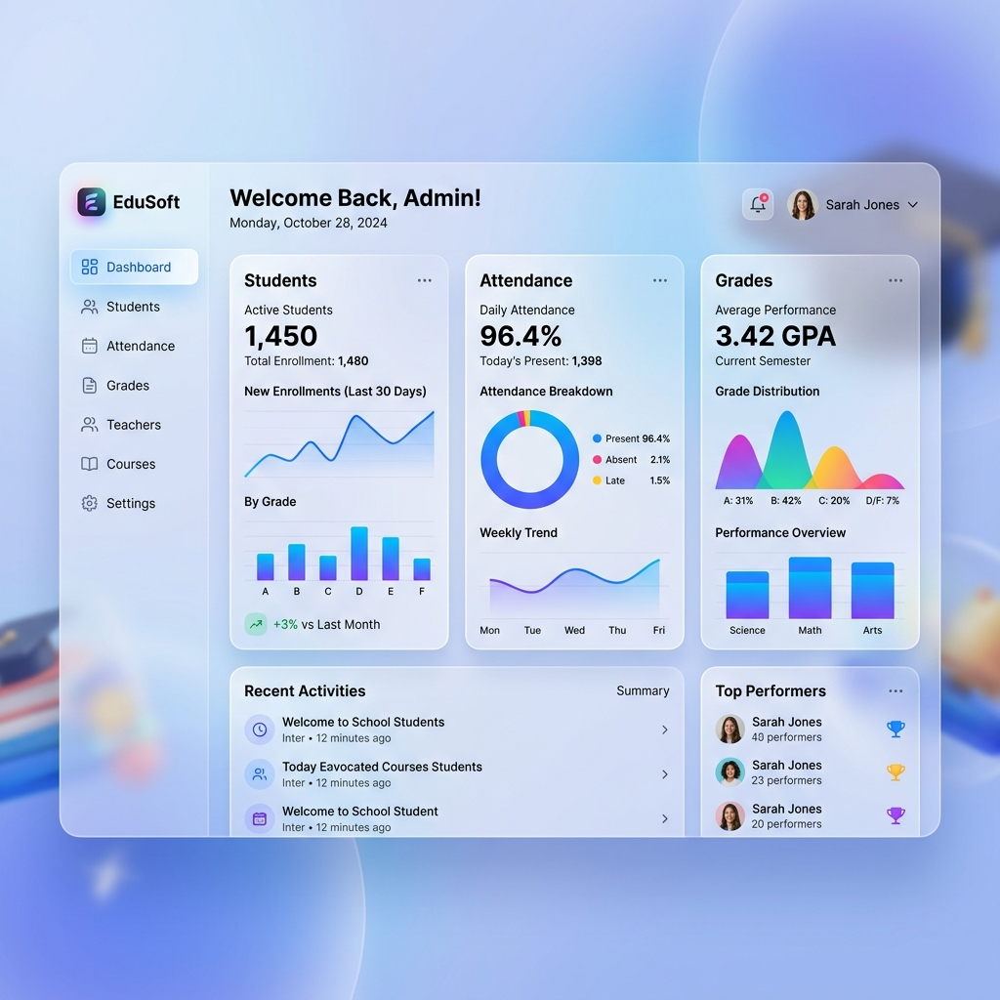
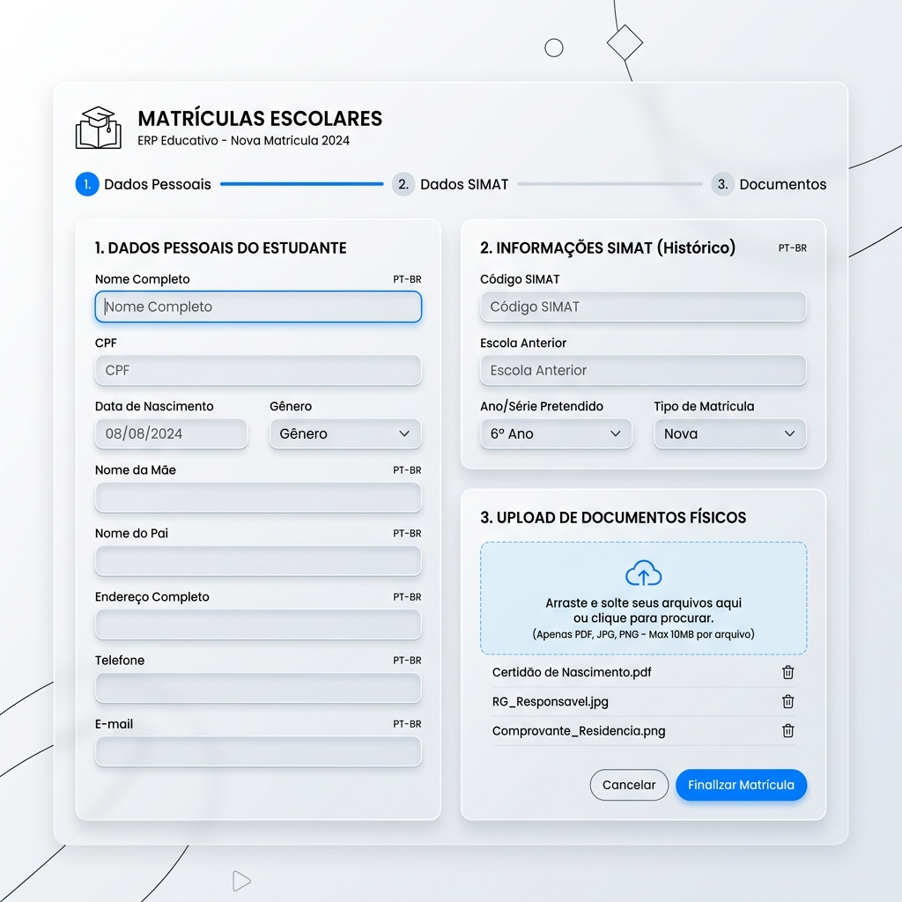
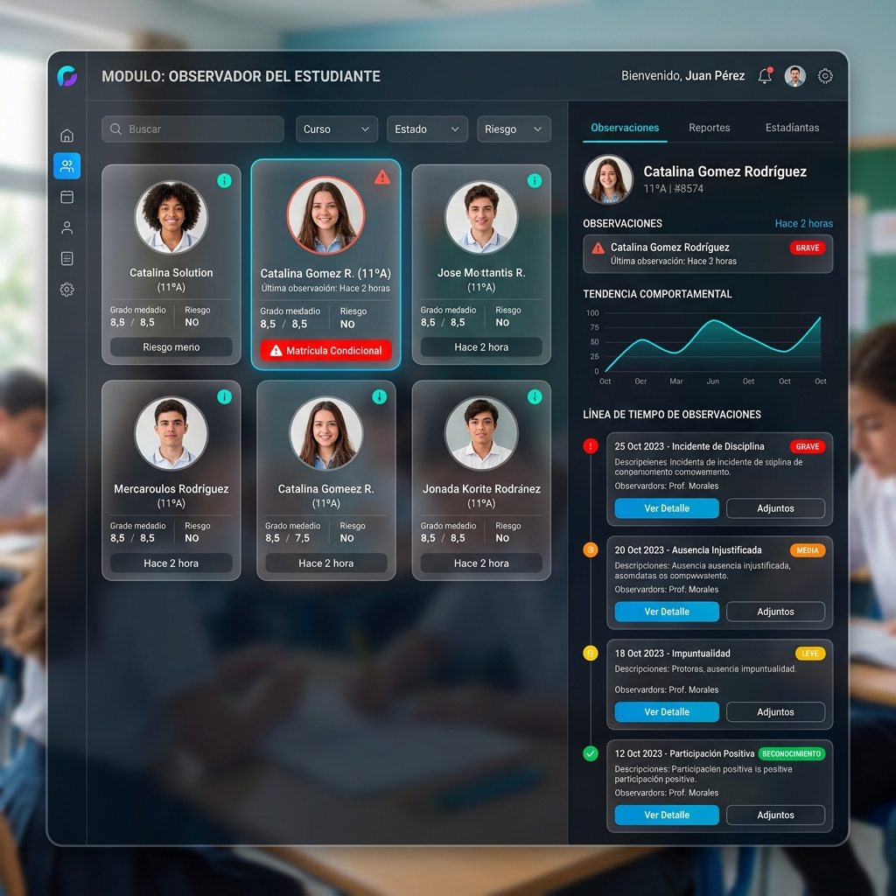

# 📘 Manual de Usuario - EduSoft ERP

¡Bienvenido al manual oficial de **EduSoft ERP**! Esta guía te enseñará cómo aprovechar al máximo nuestra plataforma de gestión escolar. EduSoft ha sido diseñado pensando en la eficiencia, la normativa educativa (MEN/SIMAT) y la mejor experiencia de usuario.

---

## 📋 Índice

1. [Primeros Pasos y Dashboard](#1-primeros-pasos-y-dashboard)
2. [Módulo de Matrículas y SIMAT](#2-módulo-de-matrículas-y-simat)
3. [Módulo de Observador del Estudiante](#3-módulo-de-observador-del-estudiante)
4. [Gestión Académica y Calificaciones](#4-gestión-académica-y-calificaciones)
5. [Reportes Oficiales](#5-reportes-oficiales)

---

## 1. Primeros Pasos y Dashboard

El **Dashboard Principal** es el centro de control de tu institución. Está diseñado con una estética *Premium Glassmorphism* que destaca las alertas más importantes sin saturar la vista.

### Características principales:
- **Alertas Tempranas**: Si hay estudiantes con "Matrícula Condicional" o docentes pendientes de subir notas, aparecerán en la pantalla principal.
- **Accesos Rápidos**: Navegación en un clic a matrículas, observador, tesorería y reportes.
- **Métricas de Rendimiento**: Visualización rápida del total de estudiantes matriculados y el porcentaje de asistencia del día.

---

## 2. Módulo de Matrículas y SIMAT

El sistema de **Matrículas** de EduSoft está alineado con los requerimientos del Ministerio de Educación Nacional para facilitar los reportes DANE.

### ¿Cómo matricular a un nuevo estudiante?

1. Dirígete a **Matrículas > Nuevo Registro**.
2. **Formulario SIMAT**: Completa los datos personales (incluyendo grupo étnico, Sisbén, EPS, y si recibe beneficios PAE o de transporte).
3. **Acudientes**: Vincula la información de la persona responsable legalmente.
4. **Repositorio Físico**: En la misma pantalla, arrastra y suelta el PDF del **Registro Civil**, **Documento de Identidad** y **Certificado Médico**. El sistema se encargará de vincular los archivos al servidor de forma segura.
5. Al finalizar, el estudiante quedará activo y el sistema le generará automáticamente un usuario y contraseña para consultar su boletín.

---

## 3. Módulo de Observador del Estudiante

Este es el ecosistema central para la convivencia escolar, donde docentes y coordinadores gestionan la hoja de vida disciplinaria.

### Funcionalidades clave:

- **Búsqueda Dinámica**: Usa los filtros por curso o nombre para encontrar rápidamente la ficha de un estudiante.
- **Registro de Observaciones**: Al hacer clic en un alumno, puedes registrar incidentes de tipo *Conductual*, *Académico* u *Otro*, asignando una severidad (Leve, Moderada, Grave).
- **Carga de Evidencia**: ¿Tienes un memorando firmado o un acta de descargo? Cárgalo directamente al registrar la observación.
- **Seguimientos**: Añade actualizaciones a una observación previa para documentar el progreso o la falta de él.
- **🔴 Matrícula Condicional**: 
  - El sistema cuenta con un **umbral configurable** (por defecto 3 faltas graves). Cuando un alumno supera el límite, su tarjeta se vuelve naranja indicando riesgo.
  - La coordinación puede usar el botón manual de "Activar Matrícula Condicional", que marcará al estudiante con una alerta roja en todos los módulos administrativos.

---

## 4. Gestión Académica y Calificaciones

Diseñado para facilitar la labor docente, minimizando errores y automatizando cálculos.

### Flujo Docente:
1. Ir a **Registro de Notas**.
2. Seleccionar el curso y la materia asignada.
3. Se desplegará la "Planilla Intuitiva" de Excel adaptada a la web.
4. Ingresa la calificación; el sistema calculará automáticamente el porcentaje basado en el esquema de evaluación (Numérico o Cualitativo).
5. **Restricciones de Período**: Las notas solo pueden ingresarse si el administrador tiene "Abierto" el período académico. Si el período cierra, el docente debe crear una *Solicitud de Desbloqueo*.

### Para Estudiantes:
- Cada estudiante accede a su propio Dashboard, donde puede consultar en tiempo real su **Boletín Académico**. Las notas cambian en tiempo real a medida que el docente califica.

---

## 5. Reportes Oficiales

EduSoft incluye un generador automático de reportes exigidos por el gobierno colombiano.

### Generar Anexo 6A:
1. Ingresa a **Reportes > Oficiales (SIMAT/DANE)**.
2. Haz clic en el botón de generación de anexos.
3. El sistema realizará una **Auditoría Preventiva**: Antes de descargar el archivo Excel, verificará que todos los estudiantes tengan ingresados los campos de Estrato, Sisbén y Población Vulnerable.
4. Si hay inconsistencias, te mostrará un listado de los estudiantes que debes corregir. Si todo está en orden, se descargará automáticamente el formato validado.

---

> **Nota:** Este manual es una guía en constante evolución. A medida que EduSoft integre los módulos de *Tesorería Financiera* y la *App Móvil para Padres*, se actualizarán estas instrucciones.
